# Stocking-Agent

[toc]

## 1. 代码架构

```python
stock_insight_agent/
│
├── config/
│   └── settings.py        ← 所有配置：API Key、数据库连接
│
├── apps/
│   ├── pipeline/          ← 数据处理核心
│   │   ├── models.py      ← 数据库表定义
│   │   ├── collector.py   ← 第1步：抓新闻
│   │   ├── extractor.py   ← 第2步：AI 结构化提取
│   │   └── reporter.py    ← 第3步：AI 生成报告
│   │
│   └── api/               ← 对外接口
│       ├── views.py       ← 所有 API 端点 + Chat 逻辑
│       ├── urls.py        ← URL 路由
│       └── templates/
│           └── index.html ← 整个前端页面（单页应用）

```

### 1.1 技术栈

| 层级         | 技术                     | 用途                                 |
| :----------- | :----------------------- | :----------------------------------- |
| **前端**     | HTML / CSS / JavaScript  | 单页应用界面                         |
|              | Chart.js                 | K线/折线图渲染                       |
| **后端框架** | Django 4.2               | Web框架、ORM、路由                   |
|              | Gunicorn                 | 生产环境 WSGI 服务器                 |
| **数据库**   | PostgreSQL               | 新闻、报告持久化存储                 |
| **AI**       | Anthropic Claude API     | 新闻提取、报告生成、Chat对话         |
|              | claude-sonnet-4-6        | Chat + 报告规划（Planner）           |
|              | claude-haiku-4-5         | 报告草稿/反思/最终版（轻量快）       |
|              | claude-sonnet-4-5        | 新闻结构化提取                       |
| **交易**     | alpaca-py SDK            | 持仓查询、下单、价格快照             |
|              | Alpaca Paper Trading API | 模拟交易账户                         |
| **数据源**   | NewsAPI                  | 科技媒体新闻采集                     |
|              | Alpha Vantage            | 财经新闻 + 股票历史K线               |
|              | Yahoo Finance RSS        | 市场动态（XML解析）                  |
| **基础设施** | Docker + Docker Compose  | 容器化部署（db/web/pipeline 三服务） |
|              | python-dotenv            | 环境变量管理                         |
|              | django-cors-headers      | 跨域请求处理                         |
|              | psycopg2                 | Python ↔ PostgreSQL 驱动             |

### 1.2 🌟系统设计思路

#### 基本代码框架

```
stock_insight_agent/
│
├── config/
│   └── settings.py        ← 所有配置：API Key、数据库连接
│
├── apps/
│   ├── pipeline/          ← 数据处理核心
│   │   ├── models.py      ← 数据库表定义
│   │   ├── collector.py   ← 第1步：抓新闻
│   │   ├── extractor.py   ← 第2步：AI 结构化提取
│   │   └── reporter.py    ← 第3步：AI 生成报告
│   │
│   └── api/               ← 对外接口
│       ├── views.py       ← 所有 API 端点 + Chat 逻辑
│       ├── urls.py        ← URL 路由
│       └── templates/
│           └── index.html ← 整个前端页面（单页应用）
```

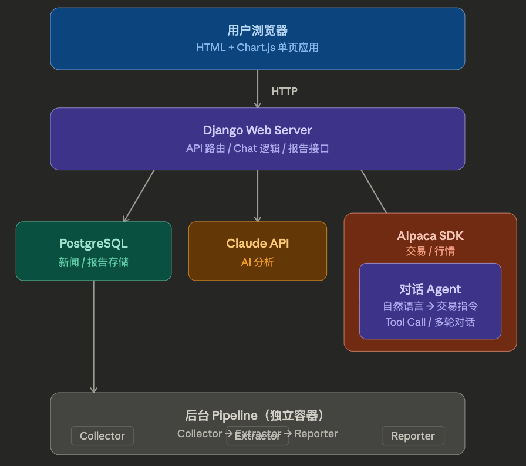

#### 关键决策

1. **报告生成用 Planner-Executor 模式**

   一次 AI 调用生成的报告质量不稳定，所以拆成 4 步迭代：

   ```
   Planner（Sonnet）   →  确定今日报告重点
   Executor（Haiku）   →  生成草稿
   Reflect（Haiku）    →  AI 自我批评打分
   Final（Haiku）      →  根据批评生成最终版
   ```

   我的vibecoding prompt: CoT思维链式提问

   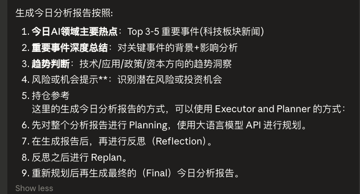

2. **新闻处理两阶段分离**

   ```
   采集（快）   →   存原始文章   →   提取（慢，调 AI）
       ↓                                    ↓
    is_extracted=False              is_extracted=True
   ```

   采集和 AI 提取可以独立重试，任何一步失败不影响另一步。

详述见下

## 2. 🌟核心流程说明 + 输出结果示例

### 2.1 数据源获取: 新闻抓取 -> 日报生成

#### 日报演示

> 生成方式：Planner → Executor → Reflection → Replan → Final

1. 可视化

   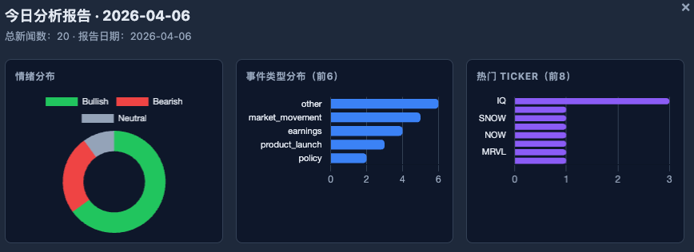

2. 今日AI领域主要热点

   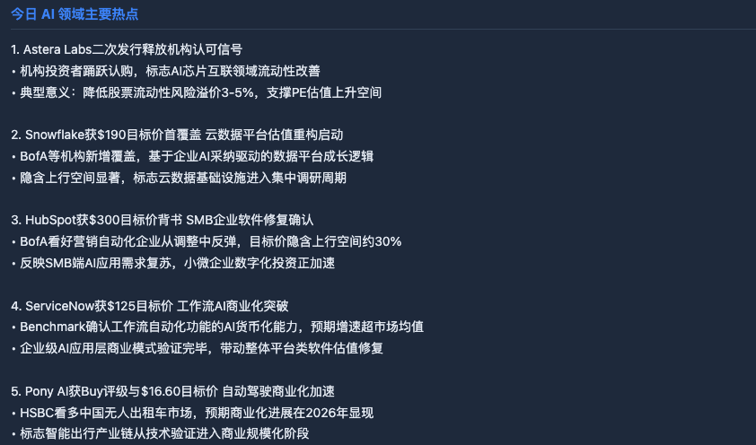

3. 重点事件深度总结

   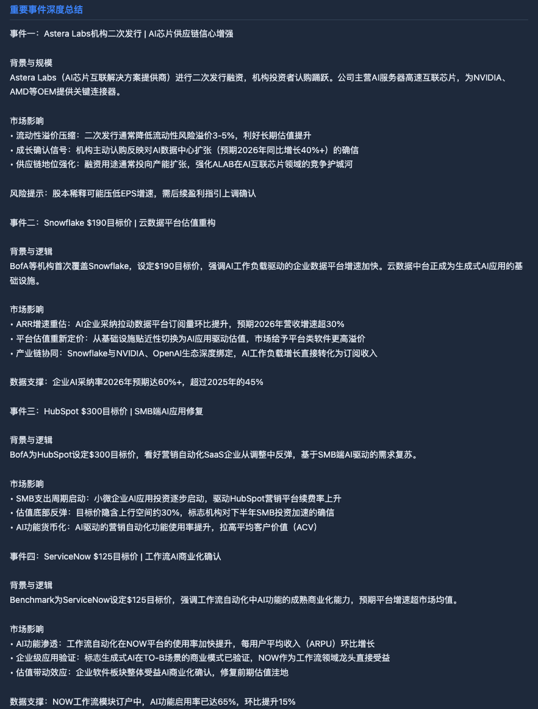

4. 趋势判断

   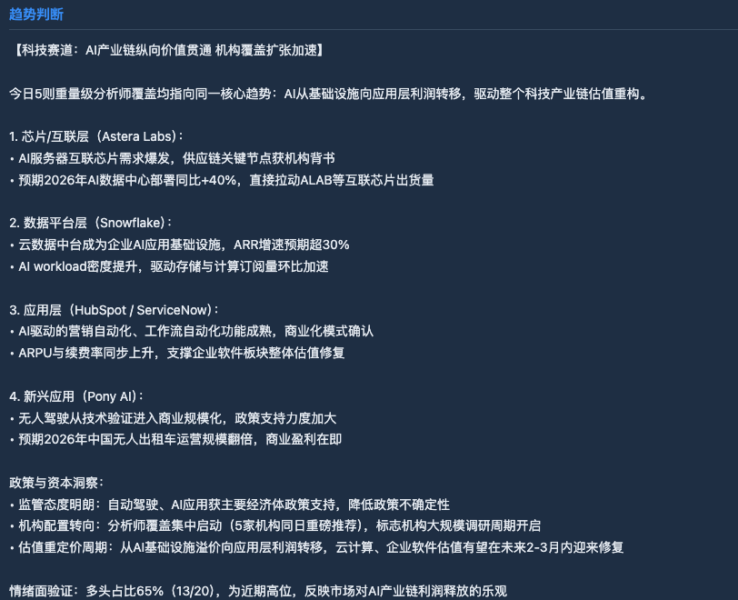

5. 🌟根据持仓板块给出投资建议

   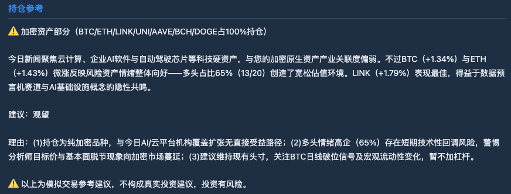

                    【collector.py】
                    从3个来源抓新闻
                    ┌─────────────────────────────────┐
                    │ NewsAPI     → 科技媒体新闻       │
                    │ AlphaVantage→ 财经新闻           │
                    │ Yahoo RSS   → 市场动态           │
                    └──────────────┬──────────────────┘
                                   │ 存入数据库
                                   ▼
                    【extractor.py】
                    Claude AI 批量分析每条新闻
                    ┌─────────────────────────────────┐
                    │ 识别相关股票代码 (NVDA, AAPL...) │
                    │ 判断情绪 (Bullish/Bearish/Neutral)│
                    │ 判断影响程度 (High/Medium/Low)   │
                    │ 生成一句话摘要                   │
                    └──────────────┬──────────────────┘
                                   │ 更新数据库
                                   ▼
                    【reporter.py】
                    4步 AI 生成每日报告
                    ┌─────────────────────────────────┐
                    │ C: Planner  → 规划报告重点        │
                    │ D: Executor → 生成草稿            │
                    │ E+F: Reflect→ AI自我批评+改进方向 │
                    │ G: Final    → 生成最终版          │
                    └──────────────┬──────────────────┘
                                   │ 存入数据库
                                   ▼
                              DailyReport 表


### 2.2 网页前后端: 持仓看板 + 新闻看板 + AI交易对话助手

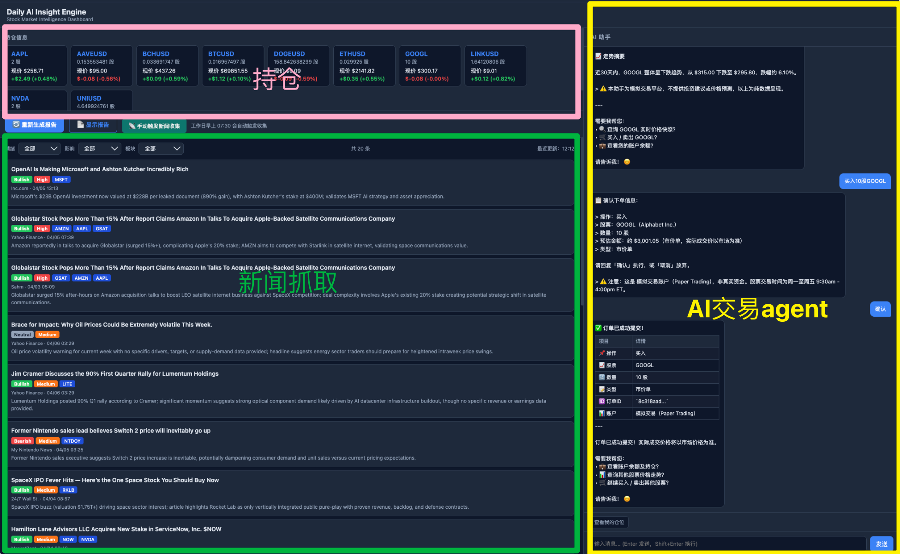

```python
浏览器 index.html
    │
    ├── GET /api/news/      → 读数据库，展示今日新闻列表
    ├── GET /api/portfolio/ → 调 Alpaca API，展示持仓
    ├── GET /api/report/    → 读数据库，展示 AI 报告
    │
    └── POST /api/chat/     → Chat 对话
            │
            └── Claude AI (agentic loop)
                    │
                    ├── get_positions    → 查持仓
                    ├── get_stock_snapshot → 查股价
                    ├── get_price_chart  → 查历史走势图
                    ├── place_order      → 下单买卖
                    └── close_position   → 平仓
```


### 2.3 DB: 新闻表 + 报告表

**新闻收集表**

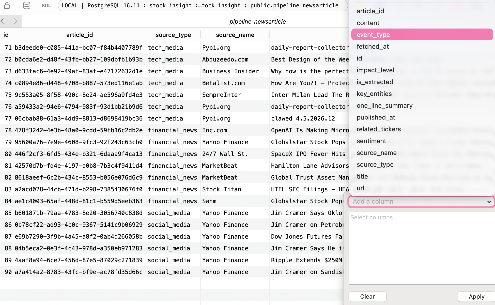

```NewsArticle（新闻表）
NewsArticle（新闻表）
┌────────────────────────────────────┐
│ title         新闻标题             │
│ content       正文内容             │
│ source_type   来源类型             │
│ published_at  发布时间             │
│ ── AI提取后填充 ──                 │
│ related_tickers  相关股票 [NVDA]   │
│ sentiment        情绪 Bullish      │
│ impact_level     影响 High         │
│ one_line_summary 一句话摘要        │
│ is_extracted     是否已AI分析      │
└────────────────────────────────────┘

DailyReport（每日报告表）
┌────────────────────────────────────┐
│ report_date   日期                 │
│ report_data   完整报告 (JSON)      │
│ status        completed            │
└────────────────────────────────────┘
```


### 2.4 对话Agent - 交易逻辑

#### 交易逻辑演示

1. 对话框确认买入

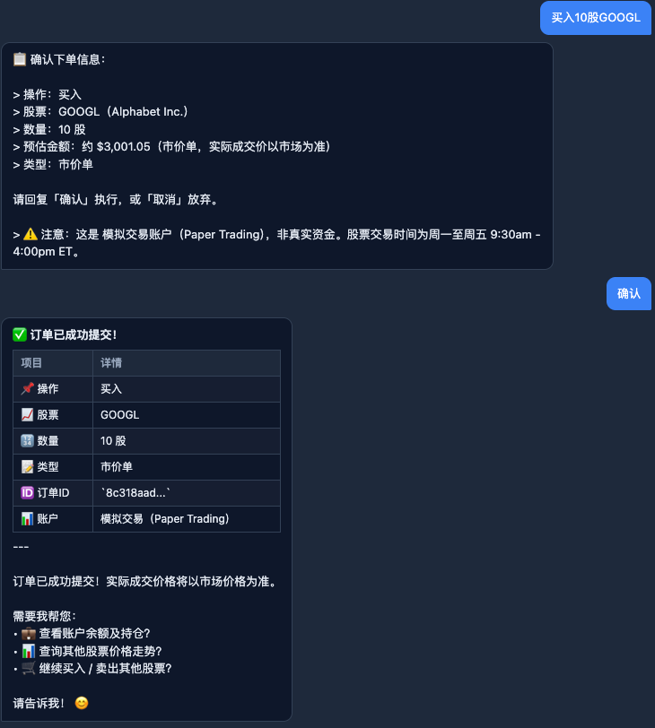

2. 前端显示持仓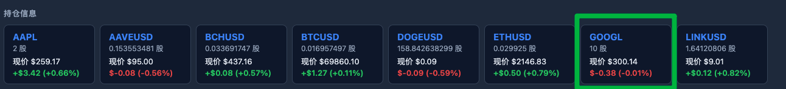

3. 后端订单操作

   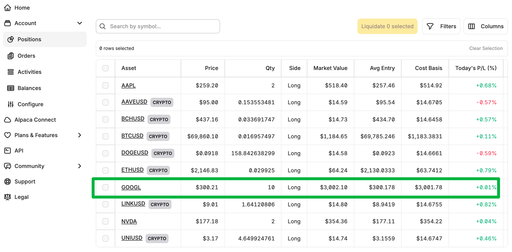

---

> 场景: 用户说"帮我买10股NVDA"
>
> 工具: Alpaca API
>
> **Agentic Loop**

```用户: "帮我买10股NVDA"
第1轮                第2轮（确认后）         第3轮
  │                      │                    │
用户说买股            用户说"确认"          工具执行完
  │                      │                    │
  ▼                      ▼                    ▼
Claude               Claude               Claude
end_turn             tool_use             end_turn
（只回文字）         （调place_order）     （总结结果）
  │                      │                    │
  ▼                      ▼                    ▼
弹确认框            execute_tool()        返回成功消息
                    → alpaca-py SDK
                    → Alpaca REST API
                    
                    
---
用户输入: "确认"
         │
         ▼
┌─────────────────────────────────────────────────────┐
│  chat() — Agentic Loop（最多循环5次）                 │
└──────────────────────┬──────────────────────────────┘
                       │
                       ▼
         ┌─────────────────────────┐
         │   Claude API（第2次）   │
         │   messages 里含上轮     │
         │   确认信息 + "确认"      │
         └────────────┬────────────┘
                      │
                      │  stop_reason = "tool_use"  ← Claude 决定调工具
                      ▼
         Claude 返回 tool_use 指令:
         {
           "name": "place_order",
           "input": {
             "symbol": "NVDA",
             "qty": 10,
             "side": "buy"
           }
         }
                      │
                      ▼
┌─────────────────────────────────────────────────────┐
│  execute_tool("place_order", input)                  │
│                                                     │
│  1. symbol = "NVDA".upper() → "NVDA"                │
│  2. _is_crypto("NVDA") → False                      │
│  3. 构建 MarketOrderRequest:                         │
│       symbol   = "NVDA"                             │
│       qty      = 10                                 │
│       side     = OrderSide.BUY                      │
│       time_in_force = TimeInForce.DAY               │
│                                                     │
│  4. _trading_client().submit_order(request)         │
│         │                                           │
│         └─→ alpaca-py SDK                           │
│               │                                     │
│               └─→ POST paper-api.alpaca.markets     │
│                        /v2/orders         (HTTP)    │
│                                                     │
│  5. 返回: "✅ 订单已提交！买入 NVDA 10股，           │
│            订单ID: a3f8bc1d..."                     │
└──────────────────────┬──────────────────────────────┘
                       │
                       ▼
         tool_result 追加进 messages，
         再次调用 Claude API（第3次）
                       │
                       │  stop_reason = "end_turn"
                       ▼
         Claude 生成最终回复（中文）:
         "✅ 已成功提交买入订单！
          买入 NVDA 10股（市价单）
          订单ID: a3f8bc1d..."
                       │
                       ▼
         返回给前端 {
           "reply": "✅ 已成功提交...",
           "action_type": "trade_executed",
           "requires_confirmation": false
         }

```


### 2.5 对话Agent - 返回走势图逻辑

#### 走势图演示

- 直接询问对话agent: 股票 + 时间段

  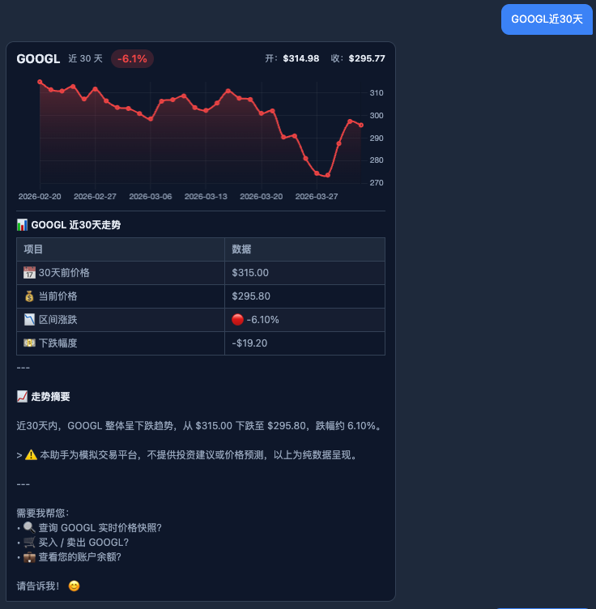

- 通过Alpha Vantage(股票)/Alpaca SDK(加密货币), 获得返回数据

  ```json
  # 原始数据长这样（每一天一条）
  [
    { "t": "2026-03-01", "c": 118.5, "h": 120.0, "l": 117.2 },
    { "t": "2026-03-02", "c": 121.3, "h": 122.5, "l": 119.8 },
    ...共30条
  ]
  #   t = 日期   c = 收盘价   h = 最高价   l = 最低价
  
  ```

- 重组数据结构循环进行tool_use, 返回前端

  ```json
  {
     // reply文字给Claude -> summary 生成回复
    "reply": "BTC近30天累计上涨12.5%，从$82000涨至$92000",
    "chart_data": {
      "labels": ["2026-03-07", "2026-03-08", ...],
      "closes": [82000, 83500, ...],
      "highs":  [84000, 85000, ...],
      "lows":   [81000, 82000, ...]
    }
  }
  ```

- 前端拿到 `chart_data` 后，直接喂给 **Chart.js** 画折线图(如上图)


```
用户提问
   ↓
Claude 调用 get_price_chart
   ↓
判断股票 or 加密货币
   ↓              ↓
Alpha Vantage   Alpaca SDK
   ↓              ↓
      拿到每日 K 线数据
            ↓
      拆成4个数组（日期/收盘/高/低）
            ↓
      打包成两份：图表数据 + 文字摘要
            ↓
      ┌─────┴─────┐
      ↓           ↓
   给Claude     给前端
   读文字       画图表


---
用户: "帮我看一下BTC最近30天走势"
         │
         ▼
┌─────────────────────────────────────────────────────┐
│  chat() — Agentic Loop                              │
│  Claude 判断需要调用 get_price_chart 工具             │
│  stop_reason = "tool_use"                           │
└──────────────────────┬──────────────────────────────┘
                       │
                       ▼
         tool_input = { symbol: "BTCUSD", days: 30 }
                       │
                       ▼
┌─────────────────────────────────────────────────────┐
│  execute_tool("get_price_chart", tool_input)        │
│                                                     │
│  Step 1: 参数标准化                                  │
│  symbol = "BTCUSD".upper().replace("/","") → "BTCUSD"│
│  days   = max(3, min(30, 365))          → 30        │
│  end_dt = date.today()                  → 2026-04-06│
│  start_dt = end_dt - timedelta(30+10)  → 2026-02-25│
└──────────────────────┬──────────────────────────────┘
                       │
                       ▼
              _is_crypto("BTCUSD")?
               /              \
             是                否
             │                 │
             ▼                 ▼
┌────────────────────┐  ┌──────────────────────────────┐
│  加密货币路径       │  │  股票路径                     │
│                    │  │                              │
│ _normalize_crypto  │  │ days > 100?                  │
│ "BTCUSD"→"BTC/USD" │  │   是 → outputsize = "full"   │
│                    │  │   否 → outputsize = "compact" │
│ CryptoBarsRequest: │  │                              │
│  symbol = "BTC/USD"│  │ GET Alpha Vantage API:       │
│  timeframe = 1Day  │  │  TIME_SERIES_DAILY           │
│  start = 2026-02-25│  │  symbol = "NVDA"             │
│  end   = 2026-04-06│  │  outputsize = "compact"      │
│  limit = 40        │  │                              │
│                    │  │ 返回按日期降序的 dict         │
│ alpaca-py SDK:     │  │ sorted(keys)[-30:]           │
│ get_crypto_bars()  │  │ → 取最近30个交易日           │
│                    │  │                              │
│ bar_set.data       │  │ bars = [                     │
│  .get("BTC/USD")   │  │  {t, c, h, l} × 30条        │
│ → List[Bar]        │  │ ]                            │
│                    │  │                              │
│ bars = [           │  └──────────────┬───────────────┘
│  {t, c, h, l}×N条 │                 │
│ ]                  │                 │
└────────────┬───────┘                 │
             └──────────┬──────────────┘
                        │
                        ▼
              ┌──────────────────┐
              │  bars 超出 days? │
              │  len(bars) > 30  │
              └────────┬─────────┘
                  是   │   否
                  ▼    │    ▼
           bars = bars[-30:]  继续
                       │
                       ▼
                  bars 为空?
                  /         \
                是            否
                │              │
                ▼              ▼
         返回错误文字     Step 2: 计算统计
         "未能获取..."
                               │
                  ┌────────────▼────────────┐
                  │  labels = ["2026-03-07",│
                  │            ...(30个日期)]│
                  │  closes = [float × 30]  │
                  │  highs  = [float × 30]  │
                  │  lows   = [float × 30]  │
                  │                         │
                  │  first = closes[0]      │
                  │  last  = closes[-1]     │
                  │  change_pct =           │
                  │  (last-first)/first×100 │
                  └────────────┬────────────┘
                               │
                               ▼
                  ┌────────────────────────────────┐
                  │  构建双轨返回数据               │
                  │                                │
                  │  chart_payload (给前端画图用):  │
                  │  {                             │
                  │    type: "chart_data"          │
                  │    symbol: "BTCUSD"            │
                  │    days: 30                    │
                  │    labels: [...]  ← X轴日期    │
                  │    closes: [...]  ← 折线数据   │
                  │    highs:  [...]  ← 高点       │
                  │    lows:   [...]  ← 低点       │
                  │    change_pct: +12.5           │
                  │  }                             │
                  │                                │
                  │  summary (给Claude读的文字):    │
                  │  "BTCUSD 近30天走势：           │
                  │   起始$82000，最新$92000，      │
                  │   区间涨跌+12.50%。已生成折线图"│
                  │                                │
                  │  return json.dumps({           │
                  │    "__chart__": chart_payload, │
                  │    "summary": summary          │
                  │  })                            │
                  └────────────┬───────────────────┘
                               │
                               ▼
┌─────────────────────────────────────────────────────┐
│  chat() 收到 raw 结果后做拆包                        │
│                                                     │
│  parsed = json.loads(raw)                           │
│  "__chart__" in parsed?  → 是                       │
│                                                     │
│  chart_data = parsed["__chart__"]  ← 存起来给前端  │
│  raw        = parsed["summary"]    ← 文字给Claude  │
└──────────────────────┬──────────────────────────────┘
                       │
          两条数据走不同的路
                       │
          ┌────────────┴────────────┐
          │                         │
          ▼                         ▼
   summary 文字                chart_data
   追加进 messages              暂存在变量里
   再次调用 Claude              等待最终一起返回
          │
          ▼
   Claude 读到 summary 后
   生成自然语言回复:
   "BTC近30天累计上涨12.5%，
    从$82000涨至$92000，
    折线图已生成👆"
          │
          ▼
┌─────────────────────────────────────────────────────┐
│  最终返回给前端                                      │
│  {                                                  │
│    "reply":      "BTC近30天累计上涨..."  ← 文字回复 │
│    "chart_data": { labels, closes,                  │
│                    highs, lows, ... } ← 图表数据    │
│    "action_type": "info"                            │
│  }                                                  │
└──────────────────────┬──────────────────────────────┘
                       │
                       ▼
            前端 index.html 收到后
            用 Chart.js 渲染折线图
```


## 🌟3. 数据源设计说明

#### 3.1 采集阶段 + 提取阶段

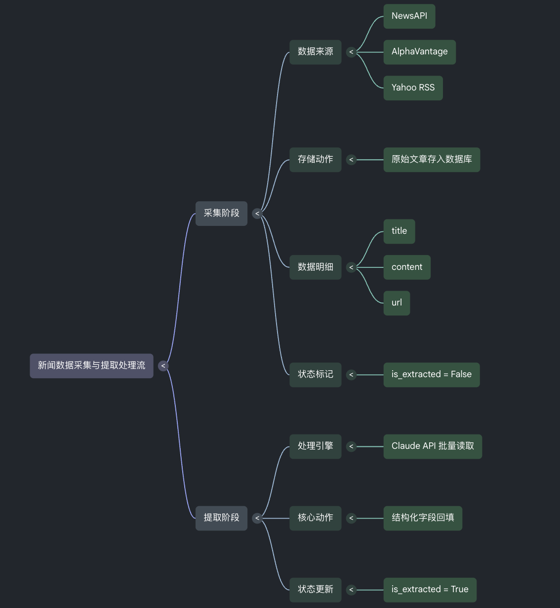

**为什么两阶段分离？** 采集和 AI 提取速度不同、可独立重试。采集失败不影响已提取数据；提取失败可对原始文章重跑，不需要重新抓取。


##### 🌟数据来源

本系统从 **3 个数据源**实时采集新闻，每日工作日早 7:30 自动触发：

| 数据源            | 类型                | 采集量 | 认证方式 |
| :---------------- | :------------------ | :----- | :------- |
| NewsAPI.org       | 科技媒体新闻        | 7条/次 | API Key  |
| Alpha Vantage     | 财经新闻 + 情感分析 | 7条/次 | API Key  |
| Yahoo Finance RSS | 市场动态            | 6条/次 | 无需认证 |

1. **NewsAPI.org — 科技媒体**
   - 关键词 `AI OR semiconductor OR EV OR earnings OR stock`，聚合 TechCrunch、Reuters 等主流科技媒体，标准化 JSON，免费版每日 100 次请求足够。

2. **Alpha Vantage — 财经新闻**
   - 主题锁定 `technology, earnings, ipo`，专注直接影响股价的财经事件。额外复用同一 API Key 获取股票历史 K 线（`TIME_SERIES_DAILY`），一个 Key 两用。

3. **Yahoo Finance RSS — 市场动态**

   - Yahoo Finance 是散户最常用的信息平台，能反映市场讨论热度

   - RSS 无速率限制，可多 Feed 并发抓取

   - 3 个 Feed 合并去重，**无需 API Key**，用标准库 `xml.etree.ElementTree` 直接解析。覆盖大盘 + 热门个股实时动态。

------

**三者组合逻辑：**

```
NewsAPI        → 宏观技术动态（机构视角）
Alpha Vantage  → 财报/IPO/政策（财经事件）
Yahoo RSS      → 热门个股讨论（市场情绪）
```

合计约 **20 条/日**，覆盖"技术 + 财经 + 情绪"三个维度。


#### 3.2 Schema设计

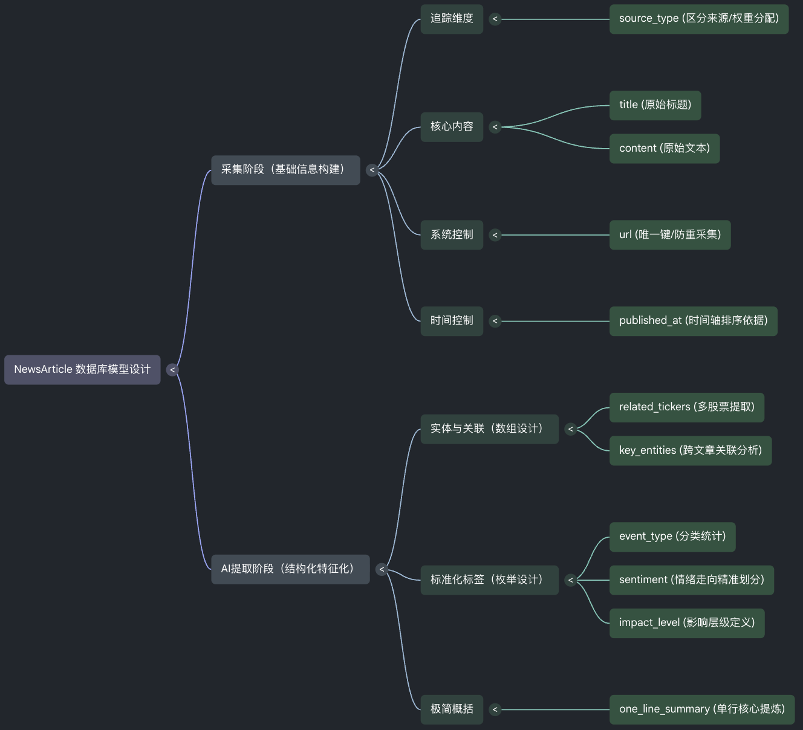

#### 3.3 字段的设计理由

- related_tickers股票代码: JSON 数组

  - 同一家公司在不同新闻来源里有不同称呼

    ```
    "Nvidia"  /  "NVDA"  /  "the chip maker"  /  "黄仁勋的公司"
                        ↓ Claude 统一抽取
                      ["NVDA"]
    ```

  - 一篇新闻可能同时涉及多只股票: 

    ```python
    # 标题："苹果宣布收购 Intel 基带芯片部门", 
    related_tickers = ["AAPL", "INTC"]

  - 可直接按 ticker 聚合，计算每只股票今日被提及频次 → 生成热度排行。

- event_type 新闻事件分类: 枚举 6 类

  - 提前定义好标签

    ```
    # 允许的值（仅这6种）
    earnings | merger_acquisition | policy | product_launch | market_movement | other

  - 自由文本无法统计。枚举后可直接做分组

  - **权重逻辑：** 财报 > 并购 > 政策 > 产品发布 > 市场波动 > 其他，报告生成时优先处理高权重事件。

- sentiment 新闻情绪(影响) : 判断股价影响

  - 提前定义好标签

    ```
    Bullish / Bearish / Neutral

  - 用LLM分析而不是关键词情感分析

    ```
    标题："监管机构对苹果展开反垄断调查"
    
    关键词情感分析 → Neutral（语气平稳）
    Claude 判断     → Bearish（预期压制股价）
    
    # 提示词工程
    # Prompt 里的强制规则
    """
    sentiment: Judge by likely stock PRICE impact, NOT article tone.
    Example: "Regulator investigates Apple" → Bearish (even if tone is neutral)
    """
    ```


#### 3.4 数据流与代码示例

- 处理逻辑

  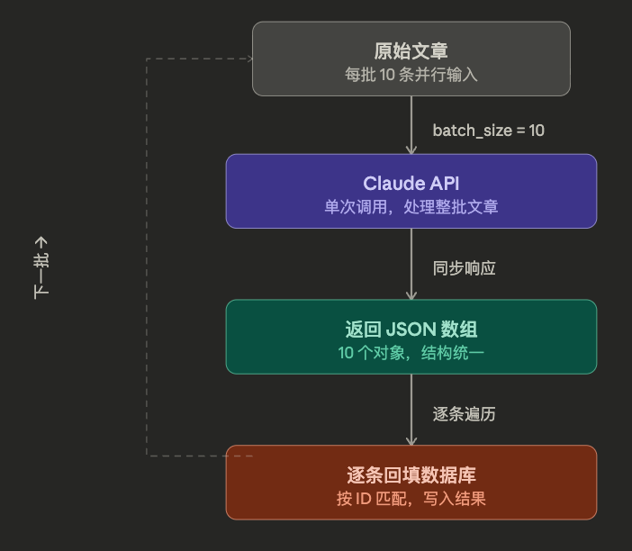

- build prompt逻辑和返回结构

  ```python
  # extractor.py — 一次 API 调用处理10条新闻
  response = client.messages.create(
      model="claude-sonnet-4-5",
      system=SYSTEM_PROMPT,
      messages=[{"role": "user", "content": user_prompt}]
  )
  
  # Claude 返回的结构（每条新闻一个对象）
  [
    {
      "related_tickers": ["NVDA", "AMD"],
      "event_type":      "earnings",
      "sentiment":       "Bullish",
      "impact_level":    "High",
      "one_line_summary": "NVIDIA Q4营收超预期20%，H100需求强劲，预计推高AI基建支出并压制AMD。",
      "key_entities":    ["NVIDIA", "Jensen Huang", "H100"]
    },
    ...
  ]
  ```

- 回填DB table

  ```python
  # 回填数据库
  for article, extracted in zip(batch, results):
      article.related_tickers  = extracted["related_tickers"]
      article.event_type       = extracted["event_type"]
      article.sentiment        = extracted["sentiment"]
      article.impact_level     = extracted["impact_level"]
      article.one_line_summary = extracted["one_line_summary"]
      article.key_entities     = extracted["key_entities"]
      article.is_extracted     = True
      article.save()

## 🌟4. AI使用方式

#### 4.0 用了哪些AI工具?

- **NotebookLM** -> 快速学习Alpaca API的功能, 并生成技术文档让vibecoding agent了解
- **Typeless** -> 语音输入 + ai优化(去噪+术语理解+结构化内容) -> 快速输入高质量prompt给vibecoding agent
  - 使用了OpenAI的whisper-large-v3-turbo: 音转文
- **Claude Code**
  - **AI Coding**
    - Plan Mode设计开发步骤
    - 90%以上的框架测试实现
  - **SKILL**
    - Superpower -> 头脑风暴
    - Skill-creator
      - 生成结合PRD的开发skill
      - 生成Alpaca API技术文档的使用skill
    - Front-design -> Claude官方前端设计skill
  - **MCP**
    - Notion: 头脑风暴阶段自动通过mcp结合我笔记中的思考, 并输出PRD等在notion中管理
    - Github: 项目开发管理
    - Alpaca: 通过对话执行股票交易
- **Antigravity** (google的类cursor IDE) -> 迅速了解局部代码的逻辑


#### 4.1 你在哪些步骤使用了AI？

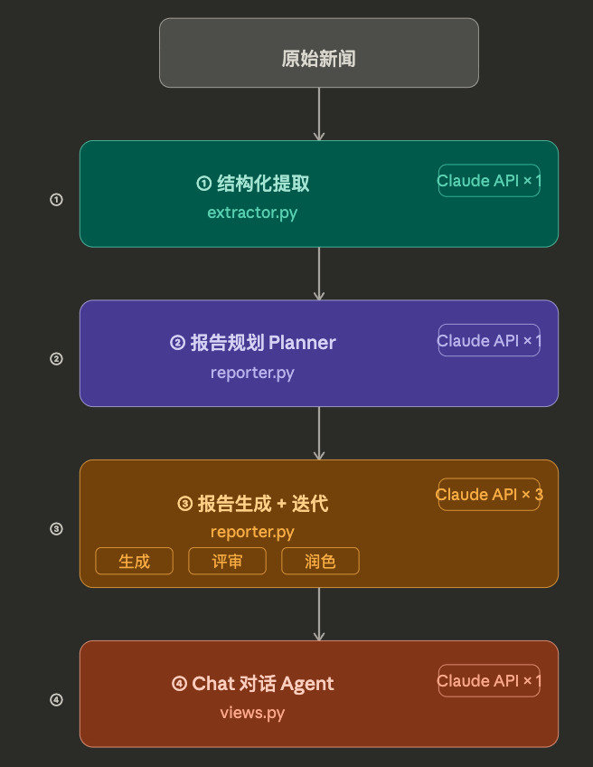

| 环节                                       | 使用方式             | 模型              |
| :----------------------------------------- | :------------------- | :---------------- |
| 新闻结构化提取/分类                        | 批量抽取 6 个字段    | claude-sonnet-4-5 |
| 🌟报告规划(planning)                        | 确定今日重点         | claude-sonnet-4-6 |
| 🌟报告草稿/反思(reflection & replan)/最终版 | 3次迭代生成          | claude-haiku-4-5  |
| Chat 对话 Agent (下单/查询走势图)          | tool_use 调用 Alpaca | claude-sonnet-4-6 |


#### 4.2 你的 Prompt 设计思路是什么？

- 展示 开发过程中的 prompt 历史记录

- 说明为什么这样设计

1. **生成PRD(头脑风暴)**

   - 目的: 理清楚系统框架, 反复敲打 → 生成完整PRD
   - 设计原因: 提示词工程, 角色+核心任务描述+背景+思维链式提问

   ```
   上传的markdown文件, 是我现在拿到的 VibeCoding 的题目。
   请使用superpower帮助我一起头脑风暴
   你是一个ai agent开发工程师
   我希望你设计系统是一个 Stocking Agent,主要分成两个功能。
   
   1. 第一个功能是每天定期获取几个板块的新闻,包括:
   ...
   
   2. 在提取这几个板块的新闻之后,会进行结构化的信息提取。
   
   ...
   
   3. 结构化提取信息之后,系统会自动生成一个分析报告和一个可视化页面(此部分同样请参考 Markdown 文件)。
   
   4. 在结构化提取信息之后,我希望增加一个对话 Agent。该 Agent 需通过 Alpaca MCP 以对话形式主要实现以下两个功能:
   
      (a) 通过对话实现股票的买卖
   
      (b) 通过对话实现仓位的获取
   
   后续我会补充 Alpaca API 的使用技术文档。
   
   1. 帮我确认完整框架; 
   2. 需要明确的需求和模糊条件直接问我; 
   3. 确认完所有问题确认框架后反思框架可行度和复杂程度;
   4. 根据反思的结果replan完整框架
   5. 全程不需要写代码
   请注意,这是一个 MVP 版本,系统架构不需要太复杂。
   最终的目的是生成一个markdown的PRD, 帮助 VibeCoding Agent 快速了解所有需求，并且一步一步开发 MVP 版本。

2. **头脑风暴**: 唤醒agent提问机制明确模糊条件

   ```
   Q: 【数据范围】你希望监控的股票是哪个范围？
   A: 不限定，关键词驱动（AI / Tech / EV 等）
   
   Q: 【结构化 Schema】新闻提取后，你最关心哪几个维度？（多选） (Select all that apply)
   A: 事件类型分类（财报 / 并购 / 政策 / 产品发布）, 影响评级（High / Medium / Low）, 情绪倾向（Bullish / Bearish / Neutral）
   
   Q: 【可视化页面】你希望可视化是什么形态？
   A: Claude Artifact 风格的交互页面
   
   Q: Q4 — 调度方式：每天定期获取新闻的触发方式？
   A: cron job 定时自动触发
   
   Q: Q5 — Alpaca Agent 入口形式？
   A: 集成在可视化页面里的 Chat UI
   
   Q: Q6 — 技术栈偏好？（帮 Vibe Coding Agent 定方向）
   A: Python
   
   Q: 「前端形态」：MVP 前端技术栈确认？
   A: Django Template 单文件 HTML（Vanilla JS + Chart.js，无前端框架）
   
   Q: 「持仓信息」：持仓、价格、盈亏您希望是如何获取？
   A: 每次页面加载实时从 Alpaca MCP 拉取（最新）
   
   Q: 「分析报告维度」：报告里的“结合持仓的投资建议”边界确认？
   A: 分析报告包含：今日热点 + 趋势判断 + 与持仓结合的投资建议
   ```

   生成PRD(vibecoding agent开发roadmap):

   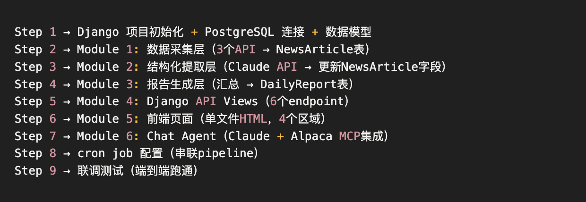

3. **制作项目SKILL**

   - 目的: 重点提到开发注意事项, 按照PRD生成SKILL进行开发

   - 使用claude官方的skill-creator

   - 设计原因: 明确核心点(结构化+分析报告) + 🌟记录每一步开发的AI使用情况(docs/AI使用报告) + 🌟使用subagent开发(防止会话累积记忆稀释)

     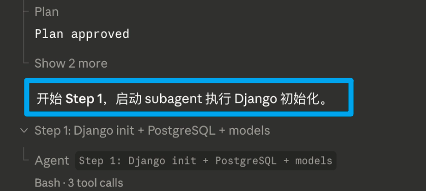

     ```
     按照这个PRD, 使用skill-creator帮我生成一个skill给vibecoding agent进行一步一步开发;
     需要在skill中明确以下几个点:
     1. 信息结构化结果（必须）
     你需要设计一个结构化数据模型（Schema），对新闻进行抽取和整理。
      要求：
        * 必须说明你的 schema 设计思路（为什么这样设计字段？）
        * 不允许仅做 summary（摘要），必须体现结构化抽取
        * 鼓励根据你的数据源特点调整 schema
     2. 分析报告
     基于结构化数据，生成一份"日报分析"，包括：
        * 今日AI领域主要热点：Top 3-5 重要事件
        * 重要事件深度总结：对关键事件的背景+影响分析
        * 趋势判断：技术/应用/政策/资本方向的趋势洞察
        * 可选：风险或机会提示：识别潜在风险或投资机会
     要求：分析必须有逻辑支撑，避免空洞描述。
     3. 在/Users/howyoulee/Daily AI Insight Engine/docs/AI使用报告这个文档中从以下几个维度回答做vibecoding记录(每次对话结束后更新)
        1. 你在哪些步骤使用了AI？
     （例如：数据清洗 / 信息抽取 / 分类 / 分析推理 / 代码生成 / 可视化等）
     		2. 你的 Prompt 设计思路是什么？
     		      * 展示 开发过程中的 prompt 历史记录
     		      * 说明为什么这样设计
     		3. 如果 AI 输出有误，你如何处理？
     		      * 错误检测机制
     		      * 重试策略
     		      * 人工介入边界
     		4. 成本与效率考量
     		      * 估算你的方案在真实场景下的token消耗
     		      * 是否有优化空间？
     4. 开发的时候使用subagent for each step
     ```

4. **Claude Code Plan模式制定开发Plan**

   - 目的: 确认开发计划, 明确每一步跟AI对话过程中AI需要验证+更新AI使用报告+告诉我如何验证+询问我是否提交PR

   - prompt: CoT提问方式, 按步骤开发完之后每一步交互操作

     ```
     第一步：根据 PRD 和 skill 确定你的开发计划；
     
     第二步：按照你的开发计划，一步一步地进行开发。
     
     其中，每一步开发时都需要满足以下要求：
     
     1. 进行验证
     
     2. 验证完之后，提交当前步骤的报告
     
     3. 询问我是否提交PR
     
     4. 告诉我如何验证
     
     完成以上步骤后，再找我寻求确认并进行下一步的开发。
     ```

5. **LLM API Prompt设计结构化提取 Prompt（extractor.py）**

   - 目标： 把自然语言新闻转换为可统计的结构化数据，而不是摘要

   - 强约束prompt + few shot(bad/good)

     ```
     SYSTEM_PROMPT = """You are a financial news analyst specializing in equity markets.
     
     STRICT RULES:
     - Respond with a valid JSON array ONLY. No markdown, no explanation, no code fences.
     - sentiment: Judge by likely stock PRICE impact, NOT article tone.
       Example: "Regulator investigates Apple" → Bearish (even if tone is neutral)
     - impact_level: High = likely >2% price move
     - one_line_summary: explain MARKET IMPLICATIONS not just facts.
       Bad:  "This may impact markets."
       Good: "NVIDIA Q4 revenue beat by 20%, driven by H100 demand; likely to push
              AI infra spending higher and pressure AMD."
     """
     
     正反例
     没有反例前 Claude 输出：
       "此事件可能对市场产生影响。"（无效）
     
     加入反例后：
       "NVIDIA Q4 营收超预期 20%，H100 需求驱动；预计推高 AI 基建支出，压制 AMD。"
     ```

6. **报告生成的Plan and Execute**

   - 报告生成采用 **Planner → Executor → Reflect → Final** 四步架构

   - 每次都是一次LLM API的调用, 不同步骤, 不同任务/角色定位/输入输出/核心要点

     ```
     Step C  Planner（Sonnet）   ←  输入：新闻统计 + 持仓
             ↓ 输出：TOP_EVENTS / KEY_TICKERS / RISK / OPPORTUNITY
     
     Step D  Executor（Haiku）   ←  输入：数据 context + Planner 规划
             ↓ 输出：5个章节草稿（===AI_HOTSPOTS=== 分隔符格式）
     
     Step E+F Reflect（Haiku）   ←  输入：草稿摘要
             ↓ 输出：SCORE + FIX1/FIX2/FIX3（纯文本，不用 JSON）
     
     Step G  Final（Haiku）      ←  输入：草稿 + 改进建议 + 持仓板块
             ↓ 输出：最终版 5 个章节

#### 4.3 如果 AI 输出有误，你如何处理？

- 错误检测机制

- 重试策略

- 人工介入边界

1. 报告生成层的错误处理

   ```python
   # 每一步都有独立 try-except，失败不影响下一步
   try:
       report_plan = plan(summary, portfolio)
   except Exception as e:
       logger.warning(f"Planner 失败，使用空 plan")
       report_plan = {}          # 降级：跳过规划，直接生成
   
   try:
       draft = execute_report(context, report_plan)
   except Exception:
       draft = {"ai_hotspots": "（AI 分析暂不可用）", ...}  # 降级文本
   
   # Final 为空时 fallback 到草稿
   for key in SECTION_MAP.values():
       if not result.get(key) and draft.get(key):
           result[key] = draft[key]   # 用草稿填充空章节
   

2. 解析报告JSON的三层fall back

   ```python
   def _parse_json(raw: str) -> dict:
       # Layer 1: 清理 markdown fence 后直接解析
       try:
           return json.loads(raw)
       except json.JSONDecodeError:
           pass
   
       # Layer 2: 提取最外层 { ... } brace matching
       start, end = raw.find("{"), raw.rfind("}")
       try:
           return json.loads(raw[start:end+1])
       except json.JSONDecodeError:
           pass
   
       # Layer 3: 让 Claude Haiku 修复破损 JSON
       repair_resp = client.messages.create(
           model="claude-haiku-4-5-20251001",
           system="Fix the broken JSON below and return ONLY valid JSON.",
           messages=[{"role": "user", "content": raw[:8000]}]
       )
       return json.loads(repair_resp.content[0].text.strip())
   

3. API超时 -> sleep(5) 重试2次

4. 人工介入 -> API调用失败(报告所有章节显示「暂不可用」) -> 检查API Key额度


#### 4.4 成本与效率考量（可选但加分）

1. **成本(估算)**

   | 环节                        | 模型       | Input tokens | Output tokens | 小计        | 说明                                        |
   | :-------------------------- | :--------- | :----------- | :------------ | :---------- | :------------------------------------------ |
   | **结构化提取**（20条，2批） | Sonnet-4-5 | ~5,000       | ~1,600        | **~6,600**  | 每批：system(200)+10篇文章×225tokens        |
   | **Planner**                 | Sonnet-4-6 | ~290         | ~180          | **~470**    | brief 摘要极短，max_tokens=300 硬限制       |
   | **Executor**                | Haiku-4-5  | ~725         | ~1,200        | **~1,925**  | 完整 context + plan JSON → 5章节草稿        |
   | **Reflect+Replan**          | Haiku-4-5  | ~340         | ~150          | **~490**    | 草稿每章截断120字 → 评分+3条建议            |
   | **Final**                   | Haiku-4-5  | ~1,145       | ~1,500        | **~2,645**  | context + 草稿(截300字) + 改进建议 → 最终版 |
   | **Chat 查询**（5次×2轮）    | Sonnet-4-6 | ~2,125       | ~1,150        | **~3,275**  | 每次：system(300)+消息+工具调用             |
   | **Chat 交易**（3次×3轮）    | Sonnet-4-6 | ~3,465       | ~690          | **~4,155**  | 确认轮+下单轮+工具结果轮                    |
   | **合计**                    |            | ~13,090      | ~6,470        | **~19,560** |                                             |

2. **优化token方案:**

   - 优化Plan & Execute方案
     - 在Plan & Execute的时候, 自建新闻template <-> 规划步骤的库(RAG知识库Agent)
     - 常规做法慢+烧token重点在于每个news的规划步骤(会用高级LLM API)
     - 通过自建新闻template <-> 规划步骤的库(RAG知识库Agent), 匹配规划处理新闻的模板, 节约plan/replan的时间
   - 分批处理（10条/批）    → 避免单次 context 过大，超出 token 限制
   - content 截断 800 字符  → 提取层每篇新闻节省约 70% token
   - Haiku 做执行，Sonnet 只做规划 → 报告生成成本降低约 60%
   - is_extracted 标记       → 重复运行跳过已处理文章，不重复计费
   - history 限最近10轮      → Chat 上下文不会无限膨胀
